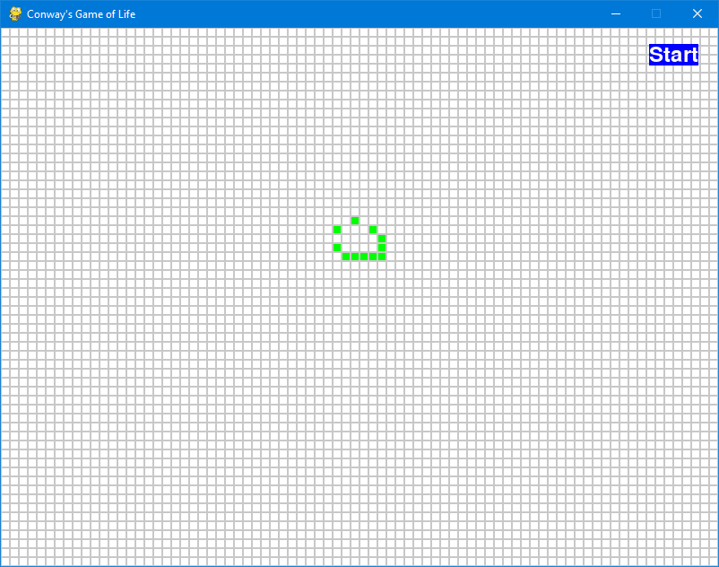

# Conway's Game of Life

This project simulates Conway's Game of Life using Pygame. It allows users to start and stop the simulation, and to toggle cells between alive and dead states.



## Description

Conway's Game of Life is a cellular automaton devised by mathematician John Conway. The game consists of a grid of cells that evolve over discrete time steps according to a set of rules based on the states of neighboring cells. This project provides an interactive simulation of the game.

## Conway's Simple Rules

The Game of Life operates on a grid of square cells, each of which can be in one of two possible states: alive or dead. The state of each cell evolves over time according to the following simple rules:

1. **Birth**: A dead cell with exactly three live neighbors becomes a live cell (as if by reproduction).
2. **Survival**: A live cell with two or three live neighbors remains alive.
3. **Death by Isolation**: A live cell with fewer than two live neighbors dies (as if by underpopulation).
4. **Death by Overcrowding**: A live cell with more than three live neighbors dies (as if by overpopulation).

Despite the simplicity of these rules, the Game of Life can produce incredibly complex and varied patterns. These patterns are often unpredictable and can exhibit behaviors that are surprisingly intricate and lifelike.

### Computational Irreducibility

One of the fascinating aspects of Conway's Game of Life is that it exhibits computational irreducibility. This means that the only way to determine the state of the grid at some future point is to simulate each step sequentially from the current state. There is no shortcut or formula to predict the future state of the grid. This property leads to the emergence of complex structures and behaviors from simple initial configurations, making the Game of Life a powerful example of how simple rules can lead to complex systems.

## Overview

This project demonstrates best practices for structuring a Python project, including proper use of virtual environments, dependencies, testing, and documentation.

## Project Structure

```
GameOfLife/
│
├── .venv/                      # virtual environment directory
│
├── src/
│   ├── GameOfLife/
│   │   ├── __init__.py         # Initializes the GameOfLife package
│   │   ├── game_of_life.py     # Contains the GameOfLife class for simulation logic
│   │   ├── main.py             # Main entry point for the application
│
├── tests/
│   ├── test_game_of_life.py    # Contains test cases for the application
│
├── README.md                   # This readme file
│
├── setup.py                    # Build script for setuptools
│
├── MANIFEST.in                 # Specifies files to include in the package
│
├── requirements.txt            # Lists the project's dependencies
│
└── run_app.py                  # Script to run the application
```

### File Descriptions

- **src/GameOfLife/\_\_init\_\_.py**: Initializes the `GameOfLife` package. This file can be empty but is necessary for Python to recognize the directory as a package.
- **src/GameOfLife/game_of_life.py**: Contains the `GameOfLife` class, which manages the grid and the rules of Conway's Game of Life.
- **src/GameOfLife/main.py**: Contains the main application entry point that sets up the Pygame window, handles events, and updates the simulation.
- **tests/test_game_of_life.py**: Contains test cases for the `GameOfLife` class using `pytest`.
- **setup.py**: This is a build script for setuptools. It tells setuptools about your package (like its name and dependencies) and can also define entry points for command-line scripts.
- **MANIFEST.in**: Specifies additional files to include in the package distribution. This ensures files like `README.md` are included when the package is distributed.
- **requirements.txt**: Lists the project's dependencies. When setting up the project, you can install all dependencies listed in this file with a single command.
- **README.md**: Provides project documentation and instructions.
- **run_app.py**: A convenience script to run the application.

## Getting Started

### Prerequisites

Make sure you have Python 3.7+ installed. It's also recommended to use a virtual environment to manage dependencies.

### Installation

1. **Clone the repository**:
    ```bash
    git clone https://github.com/khiron/life_app.git
    cd GameOfLife
    ```

2. **Set up a virtual environment**:
    ```bash
    python -m venv .venv
    .\.venv\Scripts\Activate.ps1`
    ```

3. **Install the dependencies**:
    ```bash
    pip install -r requirements.txt
    ```
This will make sure that the packages pygame and pytest are both installed in your virtual environment.


4. **Install the package**:
    ```bash
    pip install -e .
    ```
This will install the package into your virtual environment in editable mode, which means that changes you make to the source code will be reflected when you run the application.


### Running the Application

To run the application, execute the following command:
```bash
python run_app.py
```

## Usage

- **Start/Stop Simulation**: Use the Start/Stop button to control the simulation.
- **Toggle Cells**: In the stopped state, click on cells to toggle them between alive and dead.

## Testing

Run tests using pytest:
```bash
pytest
```

### Why Testing is a Good Practice

Testing ensures that your code works as expected and helps catch bugs early. It also makes it easier to refactor code with confidence.

### Test Driven Development

Writing tests before writing the actual code can help define the expected behavior and guide the development process.

## Explanation of Key Files

### `requirements.txt`
This file lists all the external packages your project depends on. When setting up your project, you can install all the necessary packages with:
```bash
pip install -r requirements.txt
```
In this project, `pygame` is listed as a dependency.

### `setup.py`
This is a script for `setuptools`, which is a Python package used for distribution. This script tells `setuptools` about your package (like its name, version, and dependencies). It also specifies entry points for command-line scripts. Here's a simplified explanation of the sections in `setup.py`:
- **name**: The name of your package.
- **version**: The current version of your package.
- **description**: A short description of your package.
- **author**: Your name.
- **author_email**: Your email address.
- **packages**: Specifies the packages to include. `find_packages(where='src')` will include all packages in the `src` directory.
- **package_dir**: Tells `setuptools` that the root package directory is `src`.
- **install_requires**: Lists the dependencies (same as in `requirements.txt`).
- **entry_points**: Defines console scripts that should be made available. In this case, it creates a command `life_app` that runs the `main` function from `GameOfLife.main`.

## Ideas for improvement

- The colours could be a little nicer.
- The grid could be made larger or smaller.
- The speed of the simulation could be adjusted.
- Display buttons to the side of the grid
- A button that clears the grid
- A button that saves the grid state to a file, or loads the grid state from a file
- a button that pre-populates the grid with some of the famous life patterns like the spaceship in the screenshot above (see https://en.wikipedia.org/wiki/Conway%27s_Game_of_Life for more).
- a button that reverts the grid to the state it was last started with (i.e. before the last time the start button was pressed)
- Showing a life surrounded by >2 neighbours in a different colour indicating it will die next generation
- Showing an empty cell surrounded by 3 neighbours in a different colour indicating it will come to life next generation
- A counter of how many cells are alive
- a high water mark of the most cells that have been alive at any moment during the simulation

## Contributing

Feel free to open issues or submit pull requests if you find any bugs or have suggestions for improvements.

## License

This project is licensed under the BSD 3-Clause License - see the LICENSE file for details.
